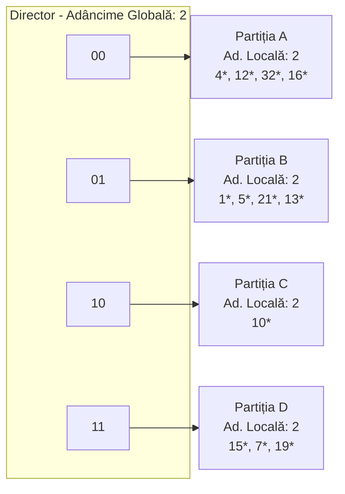

# Definirea funcțiilor de dispersie

Diviziune:

- Funcții de forma h(k) = k _mod_ N
    
- Garantează plasarea rezultatului h(k) în intervalul [0 ...N-1]
    
- E ușor de calculat $\Rightarrow$ cea mai populară abordare
    
- Dacă alegem N = $2^d$, pentru un $d$ număr natural oarecare, doar ultimii $d$ biți ai lui $k$ vor fi luați în considerare
    
- S-a arătat că numerele **prime** sunt cele mai potrivite ca valori ale lui N
    

---

# Definirea funcțiilor de dispersie

Metoda pătratului (_mid-square_):

- Se ridică numărul la pătrat apoi se extrag $l$ cifre din mijlocul rezultatului.
    
- $l = \text{lung}(k^2) - c_1 - c_2$ , unde $c_1$ și $c_2$ sunt reprezintă numărul celor mai puțin semnificative, respectiv cele mai semnificative cifre eliminate din pătratul lui $l$
    
- $l$ si $c_1$ sunt fixate de la început
    

---

# Definirea funcțiilor de dispersie

Împachetare (_folding_):

- Fiecare cheie $k$ este partiționată în bucăți de lungimi egale (cu excepția ultimei) $k_1, k_2, k_3,...,k_n$
    
- Funcția de dispersie e dată de formula
    
    $$h(k) = (k_1+ k_2+ k_3+...+ k_n) \text{ mod } 10^l$$
    
    unde $10^l$ e numărul maxim de partiții
    

---

# Definirea funcțiilor de dispersie

Multiplicare

- Se extrage partea fracționară a numărului Z * k (pentru un Z specific) și se înmulțește cu N (N fiind numărul partițiilor):
    
    $$h(k) = \lfloor N * ( Z*k - \lfloor Z*k \rfloor ) \rfloor = \lfloor N * \{Z*k\} \rfloor$$
    
- Cele mai bune rezultate se obțin pentru
    
    $Z = (\sqrt{5} - 1)/2 = 0.61803...$ sau $Z = (3 - \sqrt{5})/2 = 0.38196...$
    
- Pentru $Z = Z' / 2^w$ și $N = 2^d$ (w: număr de biți într-un cuvânt)
    
    $$h(k) = \text{msb}_d (Z'*k)$$
    
    unde $\text{msb}_d(x)$ reprezintă cei mai semnificativi d biți ai lui x
    
    (exemplu: 42 a reprez. binară 101010, $\text{msb}_3(42) = 5$ – binar 101)
    

---

# Rezolvarea coliziunilor

Noile înregistrări se memorează într-o zonă suplimentară

Se aplică o a doua funcție de dispersie pentru a obține o adresă "_second choice_".

Se memorează doar referințe (pointeri). La adresa returnată de funcția de dispersie avem:

- Toți pointerii înregistrărilor sinonime – **partiție** de adrese.
    
- Pointer către prima înregistrare. Aceasta va conține la rândul său un pointer către a doua înregistrare sinonimă, ș.a.m.d. – **listă înlănțuită**.
    
    Dispersie statică vs. dispersie dinamică
    

---

# Dispersie statică

Numărul paginilor/sloturilor _principale_ e fix

Paginile/sloturile sunt alocate secvențial, și nu sunt de-alocate; se pot utiliza pagini/sloturi _suplimentare_ dacă este nevoie

 **h(k) = k mod M** = partiția căreia îi aparține intrarea cu cheia $k$. (M = număr de partiții)

---

# Dispersie statică: Liste întrețesute

Nu se utilizează pagini/sloturi suplimentare

La inserarea unei noi intrări cu valoare cheii K:

- Dacă slotul de la adresa h(K) e gol: se memorează înregistrarea
    
- Dacă slotul de la adresa h(K) e ocupat:
    
    - se ocupă primul slot liber (căutând de la baza fișierului)
        
    - slotul ocupat e inserat la finalul listei ce conține slotul referit de h(K)
        

![[Pasted image 20260204141638.png]]

---

# Dispersie statică: Liste întrețesute

![[Pasted image 20260204141557.png]]

---

# Dispersie statică: Adresare deschisă

Fișierul conține doare date (fără pointeri)

Inserarea unei înregistrări cu valoarea cheii K:

- Dacă slotul de la adresa h(K) e gol: se memorează înregistrarea
    
- Dacă slotul de la adresa h(K) e ocupat se caută următorul slot liber la adresele h(K)+1, h(K)+2, ..., M-1, 0, ...., h(K)-1.
    
    Potrivit pentru ocupare de 75%
    

**Exemplu:**

![[Pasted image 20260204141905.png]]

---

# Dispersie statică: Adresare deschisă

Ștergerea unei înregistrări cu valoarea cheii K:

A. Înlocuirea valorii K cu un cod sau caracter special (vor trebui ajustați algoritmii de căutare și inserare pentru a interpreta corect valorile speciale)

# Dispersie statică: Adresare deschisă

- **Ștergerea unei înregistrări cu valoarea cheii K:**
    
    - **A.** Înlocuirea valorii K cu un cod sau caracter special (vor trebui ajustați algoritmii de căutare și inserare pentru a interpreta corect valorile speciale)
        
    - **B.** Se elimină înregistrarea și se fac transferuri de înregistrări astfel ($i, j, p$ sunt adrese de memorie):
        
        - $i$ e adresa înregistrării șterse,
            
        - nu sunt sloturi goale între $i$ și $j$
            
        - înregistrarea stocată la $j$ trebuie să fie stocată la $p$
            

### Scheme de transfer (Logic)

|**Cazul i<j**|**Cazul j<i**|
|---|---|
|![Diagrama 1]|![Diagrama 2]|
|$i < p \leq j : -$|$0 < p \leq j : -$|
|$j \leq p \leq m-1 :$ înreg. din $j$ se transferă la $i$|$j < p \leq i :$ înreg. din $j$ se transferă la $i$|
|$0 \leq p \leq i :$ înreg. din $j$ se transferă la $i$|$i < p \leq m-1 : -$|

# Dispersie extensibilă

- **Idee:** Dacă partițiile primare devin neîncăpătoare, fișierul se reorganizează prin _dublarea_ numărului de partiții
    
    - Fișierul va conține un <ins>director de pointeri la partiții</ins>,
        
    - Dublarea numărului de partiții se realizează prin dublarea directorului,
        
    - Se distribuie înregistrările doar din partiția ce a devenit neîncăpătoare
        
    - **Nu există pagini suplimentare!**
        
    - Funcția de dispersie va fi ajustată corespunzător
        

---

# Exemplu (Structură Director)

- Directorul are dimensiunea 4.
    
- Pentru a determina partiția lui $r$, se iau în considerare ultimii biți din reprezentarea binară a lui $h(r)$ (numărul de biți luați în considerare e dat de `adâncimea globală`).
    
    - Dacă $h(r) = 5 = \text{binar } 101$, se află în partiția referită de **01**.
        
- **<u>Inserarea</u>:** Dacă partiția e plină, aceasta se împarte în două (_se alocă o nouă pagină și se redistribuie înregistrările_).
    
- _Dacă e necesar_, directorul se dublează. (doar când _adâncimea globală_ devine mai mică decât _adâncimea locală_ a noii partiții)
    

### Vizualizare Structură

---

# Inserare k: h(k) = 20 $\rightarrow$ Dublare

- Inserare $h(k) = 20$ (binar $10100$). Ultimii **2** biți ($00$) arată că $r$ aparține lui A sau A2. E nevoie de ultimii **3** biți pentru a identifica partiția potrivită.
    
    - **Adâncimea globală a directorului:** numărul maxim de biți necesari pentru a determina partiția căreia îi aparține o înregistrare.
        
    - **Adâncimea locală a partiției:** numărul de biți utilizați pentru a determina dacă o înregistrare aparține partiției.
        
- **În ce condiții adăugarea unei noi partiții implică dublarea directorului?**
    
    - Înaintea inserării, _adâncimea locală a partiției = adâncimea globală_. Inserarea face ca _adâncimea locală să devină > adâncimea globală_; directorul se dublează prin copiere.
        

---

# Dublarea directorului

- Utilizarea celor mai puțin semnificativi biți $\rightarrow$ dublarea directorului se realizează prin copiere!
    

**Cel mai puțin semnificativ vs. Cel mai semnificativ**

(Comparație de indexare binară pentru $6 = 110$)

|**Bit LSB (Least Significant)**|**Bit MSB (Most Significant)**|
|---|---|
|000, 001, 010, 011...|000, 100, 010, 110...|

---

# Comentarii despre dispersia extensibilă

- Dacă directorul încape în memoria internă, interogările bazate pe egalități au nevoie de un singur acces la disc (suport extern);
    
    - Directorul crește brusc iar dacă distribuția valorilor funcției de dispersie nu e una normală, directorul se poate mări excesiv.
        
    - Sinonimele multiple pot crea probleme!
        
- **<u>Ștergeri</u>:** Dacă la eliminarea unei înregistrări o partiție se golește, aceasta poate fuziona cu perechea sa (ținând cont de valorile ultimilor biți ai adâncimii locale). Dacă toate adâncimile locale sunt mai mici decât adâncimea globală, directorul se poate înjumătăți.