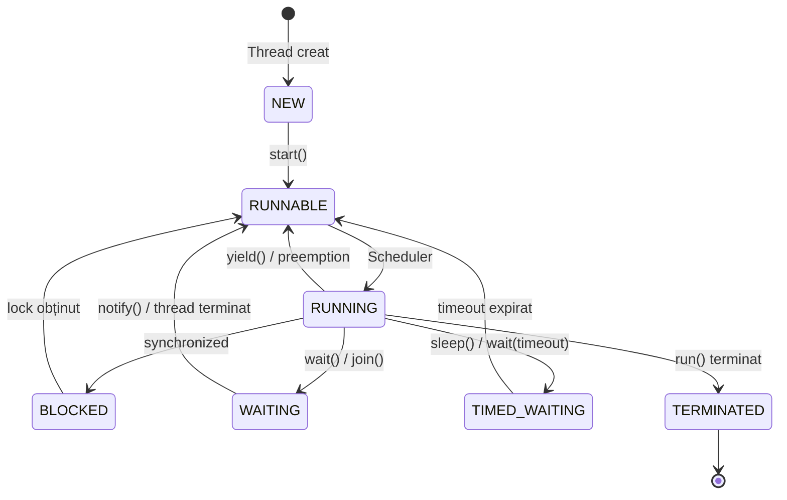

## 📖 Cuprins

1. [Ce este un Thread?](#ce-este-un-thread)
2. [Funcțiile unui Thread](#funcțiile-unui-thread)
3. [Crearea unui Thread](#crearea-unui-thread)
4. [ExecutorService și ThreadPool](#executorservice-și-threadpool)
5. [Stările unui Thread](#stările-unui-thread)
6. [Sincronizarea Thread-urilor](#sincronizarea-thread-urilor)
7. [Deadlock și Soluții](#deadlock-și-soluții)
8. [Pachetul java.util.concurrent](#pachetul-javautilconcurrent)
9. [Runnable, Callable, Future, CompletableFuture](#runnable-callable-future-completablefuture)
10. [Clase de Sincronizare](#clase-de-sincronizare)
11. [Colecții Thread-Safe](#colecții-thread-safe)
12. [Parallel Streams](#parallel-streams)

---

## Ce este un Thread?

Un **thread** (fir de execuție) este cea mai mică unitate de procesare care poate fi programată de sistemul de operare. În Java, fiecare aplicație rulează cel puțin un thread - **main thread**.

### Caracteristici principale:
- Thread-urile împărtășesc **același spațiu de memorie** (heap)
- Fiecare thread are propriul **stack** și **program counter**
- Permit **execuția concurentă** a mai multor sarcini
- Sunt mai "ușoare" decât procesele

```java
public class ExempluMain {
    public static void main(String[] args) {
        // Aceasta rulează pe main thread
        System.out.println("Thread curent: " + Thread.currentThread().getName());
        // Output: Thread curent: main
    }
}
```

---

## Funcțiile unui Thread

### Metode principale ale clasei `Thread`:

| Metodă | Descriere |
|--------|-----------|
| `start()` | Pornește execuția thread-ului |
| `run()` | Conține codul care va fi executat |
| `sleep(long millis)` | Pune thread-ul în pauză pentru o durată |
| `join()` | Așteaptă terminarea thread-ului |
| `interrupt()` | Întrerupe un thread aflat în stare de așteptare |
| `isAlive()` | Verifică dacă thread-ul este activ |
| `getName()` / `setName()` | Obține/setează numele thread-ului |
| `getPriority()` / `setPriority()` | Obține/setează prioritatea (1-10) |
| `yield()` | Sugerează scheduler-ului să permită altui thread să ruleze |

```java
public class ExempluFunctii {
    public static void main(String[] args) throws InterruptedException {
        Thread thread = new Thread(() -> {
            System.out.println("Thread pornit: " + Thread.currentThread().getName());
            try {
                Thread.sleep(2000); // Pauză 2 secunde
            } catch (InterruptedException e) {
                System.out.println("Thread întrerupt!");
            }
            System.out.println("Thread terminat!");
        });
        
        thread.setName("WorkerThread");
        thread.setPriority(Thread.MAX_PRIORITY); // Prioritate 10
        
        System.out.println("Înainte de start - isAlive: " + thread.isAlive()); // false
        thread.start();
        System.out.println("După start - isAlive: " + thread.isAlive()); // true
        
        thread.join(); // Așteaptă terminarea
        System.out.println("După join - isAlive: " + thread.isAlive()); // false
    }
}
```

---

## Crearea unui Thread

### ✅ Metoda Recomandată: Implementarea `Runnable`

> [!TIP]
> Aceasta este metoda preferată deoarece permite clasei să extindă altă clasă (Java nu suportă moștenire multiplă).

```java
// Varianta 1: Clasă separată
public class TaskRunnable implements Runnable {
    @Override
    public void run() {
        for (int i = 1; i <= 5; i++) {
            System.out.println("Runnable Task - iterația " + i);
            try {
                Thread.sleep(500);
            } catch (InterruptedException e) {
                e.printStackTrace();
            }
        }
    }
}

// Utilizare
public class Main {
    public static void main(String[] args) {
        Thread thread = new Thread(new TaskRunnable());
        thread.start();
    }
}
```

```java
// Varianta 2: Clasă anonimă
Thread thread = new Thread(new Runnable() {
    @Override
    public void run() {
        System.out.println("Rulează din clasă anonimă!");
    }
});
thread.start();
```

```java
// Varianta 3: Lambda (cea mai concisă) ⭐
Thread thread = new Thread(() -> {
    System.out.println("Rulează din lambda!");
});
thread.start();

// Sau într-o singură linie
new Thread(() -> System.out.println("Thread rapid!")).start();
```

### ⚠️ Metoda Alternativă: Extinderea clasei `Thread`

```java
public class TaskThread extends Thread {
    
    private String taskName;
    
    public TaskThread(String taskName) {
        this.taskName = taskName;
    }
    
    @Override
    public void run() {
        for (int i = 1; i <= 5; i++) {
            System.out.println(taskName + " - iterația " + i);
            try {
                Thread.sleep(500);
            } catch (InterruptedException e) {
                e.printStackTrace();
            }
        }
    }
}

// Utilizare
public class Main {
    public static void main(String[] args) {
        TaskThread thread1 = new TaskThread("Thread A");
        TaskThread thread2 = new TaskThread("Thread B");
        
        thread1.start();
        thread2.start();
    }
}
```

> [!WARNING]
> **De ce NU este recomandată extinderea Thread:**
> - Pierderea posibilității de a extinde altă clasă
> - Încălcarea principiului "prefer composition over inheritance"
> - `Runnable` separă task-ul de mecanismul de execuție
### Comparație Runnable vs Thread

| Aspect | `Runnable` | `extends Thread` |
|--------|-----------|------------------|
| Moștenire | Permite extinderea altei clase | Nu permite (Java nu are moștenire multiplă) |
| Reutilizare | Ușor de reutilizat cu ExecutorService | Legat de clasa Thread |
| Flexibilitate | Mare | Limitată |
| Recomandare | ✅ **DA** | ⚠️ Rar |

---

## ExecutorService și ThreadPool

> [!IMPORTANT]
> `ExecutorService` este modalitatea modernă și recomandată de a gestiona thread-uri în Java. Evită crearea manuală de thread-uri!

### De ce ThreadPool?

- **Reutilizare** - Thread-urile sunt reutilizate, nu create de fiecare dată
- **Control** - Limitează numărul de thread-uri active
- **Performanță** - Reduce overhead-ul creării thread-urilor
- **Gestionare** - Oferă mecanisme de shutdown și monitorizare

### Tipuri de ExecutorService

```java
import java.util.concurrent.*;

public class ExempluExecutorService {
    public static void main(String[] args) {
        
        // 1. Fixed Thread Pool - număr fix de thread-uri
        ExecutorService fixedPool = Executors.newFixedThreadPool(4);
        
        // 2. Cached Thread Pool - creează thread-uri la nevoie, le reutilizează
        ExecutorService cachedPool = Executors.newCachedThreadPool();
        
        // 3. Single Thread Executor - un singur thread, execuție secvențială
        ExecutorService singleThread = Executors.newSingleThreadExecutor();
        
        // 4. Scheduled Thread Pool - pentru task-uri programate
        ScheduledExecutorService scheduledPool = Executors.newScheduledThreadPool(2);
        
        // 5. Work Stealing Pool (Java 8+) - optimizat pentru task-uri paralele
        ExecutorService workStealingPool = Executors.newWorkStealingPool();
    }
}
```

### Exemplu complet cu Fixed Thread Pool

```java
import java.util.concurrent.*;

public class ThreadPoolDemo {
    public static void main(String[] args) {
        // Creăm un pool cu 3 thread-uri
        ExecutorService executor = Executors.newFixedThreadPool(3);
        
        // Trimitem 10 task-uri
        for (int i = 1; i <= 10; i++) {
            final int taskId = i;
            executor.submit(() -> {
                String threadName = Thread.currentThread().getName();
                System.out.println("Task " + taskId + " executat de " + threadName);
                try {
                    Thread.sleep(1000);
                } catch (InterruptedException e) {
                    e.printStackTrace();
                }
            });
        }
        
        // Oprire grațioasă
        executor.shutdown(); // Nu mai acceptă task-uri noi
        
        try {
            // Așteaptă maximum 60 secunde pentru terminare
            if (!executor.awaitTermination(60, TimeUnit.SECONDS)) {
                executor.shutdownNow(); // Forțează oprirea
            }
        } catch (InterruptedException e) {
            executor.shutdownNow();
        }
        
        System.out.println("Toate task-urile finalizate!");
    }
}
```

### Scheduled Executor - Task-uri programate

```java
import java.util.concurrent.*;

public class ScheduledDemo {
    public static void main(String[] args) {
        ScheduledExecutorService scheduler = Executors.newScheduledThreadPool(2);
        
        // Execută o singură dată după 3 secunde
        scheduler.schedule(() -> {
            System.out.println("Executat după 3 secunde");
        }, 3, TimeUnit.SECONDS);
        
        // Execută periodic la fiecare 2 secunde (după delay inițial de 1 secundă)
        scheduler.scheduleAtFixedRate(() -> {
            System.out.println("Ping! " + System.currentTimeMillis());
        }, 1, 2, TimeUnit.SECONDS);
        
        // scheduleWithFixedDelay - delay între sfârșitul unui task și începutul următorului
        scheduler.scheduleWithFixedDelay(() -> {
            System.out.println("Task cu delay fix între execuții");
        }, 0, 3, TimeUnit.SECONDS);
    }
}
```

---

## Stările unui Thread

Un thread în Java poate fi în una din următoarele **6 stări**:



### Descrierea stărilor

| Stare | Descriere | Cum se ajunge aici |
|-------|-----------|-------------------|
| **NEW** | Thread creat, dar nu pornit | `new Thread()` |
| **RUNNABLE** | Gata de execuție sau în execuție | `start()` |
| **BLOCKED** | Așteaptă un lock de sincronizare | Intră în bloc `synchronized` ocupat |
| **WAITING** | Așteaptă indefinit | `wait()`, `join()`, `LockSupport.park()` |
| **TIMED_WAITING** | Așteaptă cu timeout | `sleep(ms)`, `wait(ms)`, `join(ms)` |
| **TERMINATED** | Execuție finalizată | Metoda `run()` s-a terminat |

### Exemplu - Verificarea stărilor

```java
public class ThreadStatesDemo {
    public static void main(String[] args) throws InterruptedException {
        Object lock = new Object();
        
        Thread thread = new Thread(() -> {
            try {
                Thread.sleep(1000); // TIMED_WAITING
                synchronized (lock) {
                    lock.wait(); // WAITING
                }
            } catch (InterruptedException e) {
                e.printStackTrace();
            }
        });
        
        System.out.println("După creare: " + thread.getState()); // NEW
        
        thread.start();
        System.out.println("După start: " + thread.getState()); // RUNNABLE
        
        Thread.sleep(500);
        System.out.println("În timpul sleep: " + thread.getState()); // TIMED_WAITING
        
        Thread.sleep(1000);
        System.out.println("În timpul wait: " + thread.getState()); // WAITING
        
        synchronized (lock) {
            lock.notify();
        }
        
        thread.join();
        System.out.println("După terminare: " + thread.getState()); // TERMINATED
    }
}
```

---

## Sincronizarea Thread-urilor

### Problema: Race Condition

```java
// ❌ COD NESIGUR - Race Condition
public class ContorNesigur {
    private int count = 0;
    
    public void increment() {
        count++; // NU este atomic!
    }
    
    public int getCount() {
        return count;
    }
}
```

### Soluția 1: Excludere Mutuală cu `synchronized`

#### Metodă sincronizată

```java
public class ContorSigur {
    private int count = 0;
    
    // Întreaga metodă este sincronizată
    public synchronized void increment() {
        count++;
    }
    
    public synchronized int getCount() {
        return count;
    }
}
```

#### Bloc sincronizat

```java
public class ContorBlocSincronizat {
    private int count = 0;
    private final Object lock = new Object();
    
    public void increment() {
        synchronized (lock) { // Doar această secțiune este protejată
            count++;
        }
    }
    
    public int getCount() {
        synchronized (lock) {
            return count;
        }
    }
}
```

### Soluția 2: Lock explicit (ReentrantLock)

```java
import java.util.concurrent.locks.*;

public class ContorCuLock {
    private int count = 0;
    private final Lock lock = new ReentrantLock();
    
    public void increment() {
        lock.lock();
        try {
            count++;
        } finally {
            lock.unlock(); // ÎNTOTDEAUNA în finally!
        }
    }
    
    public int getCount() {
        lock.lock();
        try {
            return count;
        } finally {
            lock.unlock();
        }
    }
}
```

> [!TIP]
> `ReentrantLock` oferă funcționalități extra față de `synchronized`:
> - `tryLock()` - încearcă să obțină lock-ul fără blocare
> - `lockInterruptibly()` - poate fi întrerupt în timpul așteptării
> - Fair locking - ordine FIFO pentru thread-uri

### Comunicare prin Condiții: wait() și notify()

```java
public class ProducerConsumer {
    private final Queue<Integer> buffer = new LinkedList<>();
    private final int CAPACITY = 5;
    
    public synchronized void produce(int item) throws InterruptedException {
        // Așteaptă cât timp buffer-ul este plin
        while (buffer.size() == CAPACITY) {
            wait(); // Eliberează lock-ul și așteaptă
        }
        
        buffer.add(item);
        System.out.println("Produs: " + item + " | Buffer size: " + buffer.size());
        
        notifyAll(); // Notifică consumatorii
    }
    
    public synchronized int consume() throws InterruptedException {
        // Așteaptă cât timp buffer-ul este gol
        while (buffer.isEmpty()) {
            wait();
        }
        
        int item = buffer.poll();
        System.out.println("Consumat: " + item + " | Buffer size: " + buffer.size());
        
        notifyAll(); // Notifică producătorii
        return item;
    }
}

// Utilizare
public class Main {
    public static void main(String[] args) {
        ProducerConsumer pc = new ProducerConsumer();
        
        // Thread producător
        Thread producer = new Thread(() -> {
            for (int i = 1; i <= 10; i++) {
                try {
                    pc.produce(i);
                    Thread.sleep(100);
                } catch (InterruptedException e) {
                    e.printStackTrace();
                }
            }
        });
        
        // Thread consumator
        Thread consumer = new Thread(() -> {
            for (int i = 1; i <= 10; i++) {
                try {
                    pc.consume();
                    Thread.sleep(200);
                } catch (InterruptedException e) {
                    e.printStackTrace();
                }
            }
        });
        
        producer.start();
        consumer.start();
    }
}
```

### Comunicare cu Condition (pentru ReentrantLock)

```java
import java.util.concurrent.locks.*;

public class ProducerConsumerModern {
    private final Queue<Integer> buffer = new LinkedList<>();
    private final int CAPACITY = 5;
    private final Lock lock = new ReentrantLock();
    private final Condition notFull = lock.newCondition();
    private final Condition notEmpty = lock.newCondition();
    
    public void produce(int item) throws InterruptedException {
        lock.lock();
        try {
            while (buffer.size() == CAPACITY) {
                notFull.await(); // Așteaptă să nu fie plin
            }
            buffer.add(item);
            System.out.println("Produs: " + item);
            notEmpty.signal(); // Semnalizează că nu mai e gol
        } finally {
            lock.unlock();
        }
    }
    
    public int consume() throws InterruptedException {
        lock.lock();
        try {
            while (buffer.isEmpty()) {
                notEmpty.await(); // Așteaptă să nu fie gol
            }
            int item = buffer.poll();
            System.out.println("Consumat: " + item);
            notFull.signal(); // Semnalizează că nu mai e plin
            return item;
        } finally {
            lock.unlock();
        }
    }
}
```

---

## Deadlock și Soluții

### Ce este Deadlock?

**Deadlock** apare când două sau mai multe thread-uri se blochează reciproc, fiecare așteptând resursa deținută de celălalt.

```java
// ❌ EXEMPLU DE DEADLOCK
public class DeadlockDemo {
    private static final Object LOCK_A = new Object();
    private static final Object LOCK_B = new Object();
    
    public static void main(String[] args) {
        Thread thread1 = new Thread(() -> {
            synchronized (LOCK_A) {
                System.out.println("Thread 1: deține LOCK_A");
                try { Thread.sleep(100); } catch (Exception e) {}
                
                System.out.println("Thread 1: așteaptă LOCK_B");
                synchronized (LOCK_B) {
                    System.out.println("Thread 1: deține ambele lock-uri");
                }
            }
        });
        
        Thread thread2 = new Thread(() -> {
            synchronized (LOCK_B) { // ⚠️ Ordinea inversă cauzează deadlock!
                System.out.println("Thread 2: deține LOCK_B");
                try { Thread.sleep(100); } catch (Exception e) {}
                
                System.out.println("Thread 2: așteaptă LOCK_A");
                synchronized (LOCK_A) {
                    System.out.println("Thread 2: deține ambele lock-uri");
                }
            }
        });
        
        thread1.start();
        thread2.start();
    }
}
```

### Condiții necesare pentru Deadlock (Coffman)

1. **Excludere mutuală** - resursa poate fi deținută de un singur thread
2. **Hold and Wait** - thread-ul deține o resursă și așteaptă alta
3. **No Preemption** - resursele nu pot fi luate forțat
4. **Circular Wait** - lanț circular de așteptare

### ✅ Soluții pentru Deadlock

#### Soluția 1: Ordine consistentă a lock-urilor

```java
// ✅ SOLUȚIE: Aceeași ordine pentru toate thread-urile
public class NoDeadlock {
    private static final Object LOCK_A = new Object();
    private static final Object LOCK_B = new Object();
    
    public static void main(String[] args) {
        Thread thread1 = new Thread(() -> {
            synchronized (LOCK_A) {  // Întâi A
                synchronized (LOCK_B) {  // Apoi B
                    System.out.println("Thread 1: OK");
                }
            }
        });
        
        Thread thread2 = new Thread(() -> {
            synchronized (LOCK_A) {  // Întâi A (aceeași ordine!)
                synchronized (LOCK_B) {  // Apoi B
                    System.out.println("Thread 2: OK");
                }
            }
        });
        
        thread1.start();
        thread2.start();
    }
}
```

#### Soluția 2: tryLock() cu timeout

```java
import java.util.concurrent.locks.*;
import java.util.concurrent.TimeUnit;

public class TryLockSolution {
    private final Lock lockA = new ReentrantLock();
    private final Lock lockB = new ReentrantLock();
    
    public void method1() {
        while (true) {
            if (lockA.tryLock()) {
                try {
                    if (lockB.tryLock(100, TimeUnit.MILLISECONDS)) {
                        try {
                            // Cod cu ambele lock-uri
                            System.out.println("Ambele lock-uri obținute!");
                            return;
                        } finally {
                            lockB.unlock();
                        }
                    }
                } catch (InterruptedException e) {
                    e.printStackTrace();
                } finally {
                    lockA.unlock();
                }
            }
            // Așteaptă și încearcă din nou
            try { Thread.sleep(50); } catch (Exception e) {}
        }
    }
}
```

#### Soluția 3: Lock ordering cu comparație

```java
public class LockOrderingSolution {
    
    public void transfer(Account from, Account to, int amount) {
        // Ordine bazată pe ID pentru consistență
        Account first = from.getId() < to.getId() ? from : to;
        Account second = from.getId() < to.getId() ? to : from;
        
        synchronized (first) {
            synchronized (second) {
                from.withdraw(amount);
                to.deposit(amount);
            }
        }
    }
}
```

---

## Pachetul java.util.concurrent

> [!NOTE]
> Acest pachet oferă implementări de nivel înalt pentru programarea concurentă, reducând nevoia de sincronizare manuală.

### Structura pachetului

```
java.util.concurrent
├── Executors & Thread Pools
│   ├── Executor
│   ├── ExecutorService
│   ├── ScheduledExecutorService
│   ├── ThreadPoolExecutor
│   └── Executors (factory)
│
├── Future & Callable
│   ├── Callable<V>
│   ├── Future<V>
│   ├── CompletableFuture<V>
│   └── FutureTask<V>
│
├── Locks
│   ├── Lock
│   ├── ReentrantLock
│   ├── ReadWriteLock
│   ├── ReentrantReadWriteLock
│   └── StampedLock
│
├── Synchronization Utilities
│   ├── Semaphore
│   ├── CountDownLatch
│   ├── CyclicBarrier
│   ├── Phaser
│   └── Exchanger
│
├── Concurrent Collections
│   ├── ConcurrentHashMap
│   ├── ConcurrentLinkedQueue
│   ├── CopyOnWriteArrayList
│   ├── BlockingQueue (interface)
│   └── LinkedBlockingQueue
│
└── Atomic Variables
    ├── AtomicInteger
    ├── AtomicLong
    ├── AtomicBoolean
    ├── AtomicReference
    └── LongAdder
```

---

## Runnable, Callable, Future, CompletableFuture

### Runnable

Interfață funcțională pentru task-uri care **nu returnează rezultat**.

```java
@FunctionalInterface
public interface Runnable {
    void run();
}

// Utilizare
Runnable task = () -> System.out.println("Task simplu!");
new Thread(task).start();
```

### Callable

Interfață funcțională pentru task-uri care **returnează un rezultat** și pot arunca excepții.

```java
@FunctionalInterface
public interface Callable<V> {
    V call() throws Exception;
}

// Utilizare
Callable<Integer> task = () -> {
    Thread.sleep(1000);
    return 42;
};

ExecutorService executor = Executors.newSingleThreadExecutor();
Future<Integer> future = executor.submit(task);
```

### Future

Reprezintă rezultatul unei operații asincrone.

```java
import java.util.concurrent.*;

public class FutureDemo {
    public static void main(String[] args) throws Exception {
        ExecutorService executor = Executors.newFixedThreadPool(2);
        
        // Submit returnează un Future
        Future<String> future = executor.submit(() -> {
            Thread.sleep(2000);
            return "Rezultat din task";
        });
        
        System.out.println("Task trimis, fac altceva...");
        
        // Verifică dacă e gata (non-blocking)
        System.out.println("isDone: " + future.isDone()); // false
        
        // Obține rezultatul (blocking)
        String result = future.get(); // Așteaptă terminarea
        System.out.println("Rezultat: " + result);
        
        // Cu timeout
        Future<String> future2 = executor.submit(() -> {
            Thread.sleep(5000);
            return "Alt rezultat";
        });
        
        try {
            String result2 = future2.get(2, TimeUnit.SECONDS); // Timeout 2s
        } catch (TimeoutException e) {
            System.out.println("Timeout! Task-ul durează prea mult.");
            future2.cancel(true); // Anulează task-ul
        }
        
        executor.shutdown();
    }
}
```

### CompletableFuture ⭐

Cea mai puternică abstractizare pentru programare asincronă în Java.

```java
import java.util.concurrent.*;

public class CompletableFutureDemo {
    public static void main(String[] args) throws Exception {
        
        // 1. Task asincron simplu
        CompletableFuture<String> cf1 = CompletableFuture.supplyAsync(() -> {
            sleep(1000);
            return "Hello";
        });
        
        // 2. Transformare rezultat (thenApply)
        CompletableFuture<String> cf2 = cf1.thenApply(s -> s + " World");
        
        // 3. Chain de operații
        CompletableFuture<Integer> result = CompletableFuture
            .supplyAsync(() -> "100")
            .thenApply(Integer::parseInt)
            .thenApply(n -> n * 2);
        
        System.out.println("Rezultat chain: " + result.get()); // 200
        
        // 4. Combinarea a două Future-uri
        CompletableFuture<String> hello = CompletableFuture.supplyAsync(() -> "Hello");
        CompletableFuture<String> world = CompletableFuture.supplyAsync(() -> "World");
        
        CompletableFuture<String> combined = hello.thenCombine(world, 
            (h, w) -> h + " " + w);
        System.out.println(combined.get()); // Hello World
        
        // 5. Acțiune la terminare (thenAccept - nu returnează nimic)
        CompletableFuture.supplyAsync(() -> "Test")
            .thenAccept(s -> System.out.println("Primit: " + s));
        
        // 6. Gestionarea erorilor
        CompletableFuture<Integer> withError = CompletableFuture
            .supplyAsync(() -> {
                if (true) throw new RuntimeException("Eroare!");
                return 42;
            })
            .exceptionally(ex -> {
                System.out.println("Eroare capturată: " + ex.getMessage());
                return -1; // Valoare default
            });
        
        System.out.println("Cu eroare: " + withError.get()); // -1
        
        // 7. Așteptarea mai multor Future-uri
        CompletableFuture<String> f1 = CompletableFuture.supplyAsync(() -> {
            sleep(1000); return "F1";
        });
        CompletableFuture<String> f2 = CompletableFuture.supplyAsync(() -> {
            sleep(2000); return "F2";
        });
        CompletableFuture<String> f3 = CompletableFuture.supplyAsync(() -> {
            sleep(1500); return "F3";
        });
        
        // Așteaptă toate
        CompletableFuture<Void> allOf = CompletableFuture.allOf(f1, f2, f3);
        allOf.join();
        System.out.println("Toate finalizate!");
        
        // Așteaptă oricare (primul care termină)
        CompletableFuture<Object> anyOf = CompletableFuture.anyOf(f1, f2, f3);
        System.out.println("Primul terminat: " + anyOf.get());
    }
    
    private static void sleep(long ms) {
        try { Thread.sleep(ms); } catch (Exception e) {}
    }
}
```

### Comparație Runnable vs Callable vs CompletableFuture

| Caracteristică | Runnable | Callable | CompletableFuture |
|----------------|----------|----------|-------------------|
| Returnează valoare | ❌ Nu | ✅ Da | ✅ Da |
| Excepții checked | ❌ Nu | ✅ Da | ✅ Da |
| Chainable | ❌ Nu | ❌ Nu | ✅ Da |
| Combinabil | ❌ Nu | ❌ Nu | ✅ Da |
| Error handling | Manual | Manual | ✅ Built-in |

---

## Clase de Sincronizare

### Semaphore

Controlează accesul la un număr limitat de resurse.

```java
import java.util.concurrent.*;

public class SemaphoreDemo {
    // Permite maxim 3 thread-uri simultan
    private static final Semaphore semaphore = new Semaphore(3);
    
    public static void main(String[] args) {
        // Simulăm 10 clienți la o bază de date cu 3 conexiuni
        for (int i = 1; i <= 10; i++) {
            final int clientId = i;
            new Thread(() -> {
                try {
                    System.out.println("Client " + clientId + " așteaptă conexiune...");
                    
                    semaphore.acquire(); // Blochează dacă nu sunt permise disponibile
                    
                    System.out.println("Client " + clientId + " conectat! Permise rămase: " 
                        + semaphore.availablePermits());
                    Thread.sleep(2000); // Folosește conexiunea
                    
                    System.out.println("Client " + clientId + " a terminat.");
                } catch (InterruptedException e) {
                    e.printStackTrace();
                } finally {
                    semaphore.release(); // Eliberează permit-ul
                }
            }).start();
        }
    }
}
```

### Mutex (Binary Semaphore)

Un **Mutex** este un Semaphore cu o singură permisiune.

```java
// Mutex = Semaphore(1)
Semaphore mutex = new Semaphore(1);

// Sau folosind ReentrantLock care e mai eficient pentru acest caz
Lock mutex2 = new ReentrantLock();
```

```java
public class MutexDemo {
    private final Semaphore mutex = new Semaphore(1);
    private int sharedResource = 0;
    
    public void accessResource() throws InterruptedException {
        mutex.acquire();
        try {
            sharedResource++;
            System.out.println(Thread.currentThread().getName() + 
                " - Resource value: " + sharedResource);
            Thread.sleep(500);
        } finally {
            mutex.release();
        }
    }
}
```

### CountDownLatch

Permite unui thread să aștepte terminarea mai multor operații.

```java
import java.util.concurrent.*;

public class CountDownLatchDemo {
    public static void main(String[] args) throws InterruptedException {
        int numWorkers = 5;
        CountDownLatch latch = new CountDownLatch(numWorkers);
        
        System.out.println("Așteptăm " + numWorkers + " workeri să termine...");
        
        for (int i = 1; i <= numWorkers; i++) {
            final int workerId = i;
            new Thread(() -> {
                try {
                    Thread.sleep((long)(Math.random() * 3000));
                    System.out.println("Worker " + workerId + " a terminat!");
                } catch (InterruptedException e) {
                    e.printStackTrace();
                } finally {
                    latch.countDown(); // Decrementează counter-ul
                }
            }).start();
        }
        
        latch.await(); // Blochează până când counter-ul ajunge la 0
        System.out.println("Toți workerii au terminat! Continuăm...");
    }
}
```

> [!WARNING]
> `CountDownLatch` este **one-shot** - nu poate fi resetat după ce ajunge la 0!

### CyclicBarrier

Permite mai multor thread-uri să se aștepte reciproc la un punct de sincronizare. **Poate fi reutilizat!**

```java
import java.util.concurrent.*;

public class CyclicBarrierDemo {
    public static void main(String[] args) {
        int numPlayers = 4;
        
        // Acțiune executată când toți ajung la barieră
        CyclicBarrier barrier = new CyclicBarrier(numPlayers, () -> {
            System.out.println(">>> Toți jucătorii gata! Începe runda! <<<\n");
        });
        
        for (int i = 1; i <= numPlayers; i++) {
            final int playerId = i;
            new Thread(() -> {
                try {
                    // Runda 1
                    System.out.println("Jucător " + playerId + " se pregătește pentru runda 1...");
                    Thread.sleep((long)(Math.random() * 2000));
                    System.out.println("Jucător " + playerId + " gata pentru runda 1!");
                    barrier.await(); // Așteaptă pe ceilalți
                    
                    // Runda 2 (bariera se resetează automat!)
                    System.out.println("Jucător " + playerId + " se pregătește pentru runda 2...");
                    Thread.sleep((long)(Math.random() * 2000));
                    System.out.println("Jucător " + playerId + " gata pentru runda 2!");
                    barrier.await();
                    
                } catch (InterruptedException | BrokenBarrierException e) {
                    e.printStackTrace();
                }
            }).start();
        }
    }
}
```

### Comparație CountDownLatch vs CyclicBarrier

| Caracteristică | CountDownLatch | CyclicBarrier |
|----------------|----------------|---------------|
| Reutilizabil | ❌ Nu | ✅ Da |
| Scop | Un thread așteaptă N | N thread-uri se așteaptă reciproc |
| Reset | Nu se poate | Automat sau manual |
| Acțiune la terminare | ❌ Nu | ✅ Da (Runnable opțional) |

---

## Colecții Thread-Safe

### Probleme cu colecțiile standard

```java
// ❌ NESIGUR pentru acces concurent
List<String> list = new ArrayList<>();
Map<String, Integer> map = new HashMap<>();
```

### Soluții Thread-Safe

#### 1. Collections.synchronized*

```java
// Wrapper sincronizat (performanță mai slabă)
List<String> syncList = Collections.synchronizedList(new ArrayList<>());
Map<String, Integer> syncMap = Collections.synchronizedMap(new HashMap<>());
Set<String> syncSet = Collections.synchronizedSet(new HashSet<>());

// ⚠️ Iterarea necesită sincronizare manuală!
synchronized (syncList) {
    for (String s : syncList) {
        System.out.println(s);
    }
}
```

#### 2. ConcurrentHashMap ⭐

```java
import java.util.concurrent.*;

ConcurrentHashMap<String, Integer> map = new ConcurrentHashMap<>();

// Operații atomice built-in
map.put("key", 1);
map.putIfAbsent("key2", 2);
map.computeIfAbsent("key3", k -> computeValue(k));
map.computeIfPresent("key", (k, v) -> v + 1);

// Iterare sigură (nu aruncă ConcurrentModificationException)
map.forEach((k, v) -> System.out.println(k + ": " + v));

// Operații atomice de actualizare
map.merge("key", 1, Integer::sum);
```

#### 3. CopyOnWriteArrayList

Ideal pentru liste cu multe citiri și puține scrieri.

```java
import java.util.concurrent.*;

CopyOnWriteArrayList<String> list = new CopyOnWriteArrayList<>();

list.add("item1");
list.add("item2");

// Iterare sigură (folosește un snapshot)
for (String item : list) {
    System.out.println(item);
    list.add("newItem"); // Nu afectează iterația curentă
}
```

> [!CAUTION]
> `CopyOnWriteArrayList` creează o copie la fiecare modificare - costisitor pentru scrieri frecvente!

#### 4. BlockingQueue

Cozi cu operații blocante - perfecte pentru Producer-Consumer.

```java
import java.util.concurrent.*;

public class BlockingQueueDemo {
    public static void main(String[] args) {
        BlockingQueue<String> queue = new LinkedBlockingQueue<>(10);
        
        // Producer
        new Thread(() -> {
            try {
                for (int i = 1; i <= 20; i++) {
                    queue.put("Item " + i); // Blochează dacă queue-ul e plin
                    System.out.println("Produs: Item " + i);
                }
            } catch (InterruptedException e) {
                e.printStackTrace();
            }
        }).start();
        
        // Consumer
        new Thread(() -> {
            try {
                while (true) {
                    String item = queue.take(); // Blochează dacă queue-ul e gol
                    System.out.println("Consumat: " + item);
                    Thread.sleep(500);
                }
            } catch (InterruptedException e) {
                e.printStackTrace();
            }
        }).start();
    }
}
```

### Implementări BlockingQueue

| Implementare | Descriere |
|--------------|-----------|
| `ArrayBlockingQueue` | Capacitate fixă, array |
| `LinkedBlockingQueue` | Capacitate opțională, linked list |
| `PriorityBlockingQueue` | Cu prioritate, nelimitat |
| `DelayQueue` | Elemente disponibile după un delay |
| `SynchronousQueue` | Capacitate 0, handoff direct |

---

## Parallel Streams

Java 8+ oferă procesare paralelă automată prin Streams API.

### Conversie la Parallel Stream

```java
import java.util.*;
import java.util.stream.*;

public class ParallelStreamDemo {
    public static void main(String[] args) {
        List<Integer> numbers = IntStream.rangeClosed(1, 1000000)
            .boxed()
            .collect(Collectors.toList());
        
        // Stream secvențial
        long start = System.currentTimeMillis();
        long sumSeq = numbers.stream()
            .mapToLong(n -> processNumber(n))
            .sum();
        System.out.println("Secvențial: " + (System.currentTimeMillis() - start) + "ms");
        
        // Parallel stream
        start = System.currentTimeMillis();
        long sumPar = numbers.parallelStream()
            .mapToLong(n -> processNumber(n))
            .sum();
        System.out.println("Parallel: " + (System.currentTimeMillis() - start) + "ms");
    }
    
    private static long processNumber(int n) {
        // Simulează procesare
        return (long) Math.sqrt(n);
    }
}
```

### Când să folosești Parallel Streams?

| ✅ Folosește când | ❌ Evită când |
|-------------------|---------------|
| Colecție mare (>10000 elemente) | Colecție mică |
| Operații CPU-intensive | Operații I/O |
| Operații independente | Ordine contează |
| Structuri eficiente (ArrayList) | LinkedList |

### Operații cu stare - Atenție!

```java
// ❌ PERICULOS - variabilă partajată
List<Integer> results = new ArrayList<>(); // Nesigur!
numbers.parallelStream()
    .filter(n -> n > 50)
    .forEach(n -> results.add(n)); // Race condition!

// ✅ SIGUR - folosește collect
List<Integer> results = numbers.parallelStream()
    .filter(n -> n > 50)
    .collect(Collectors.toList()); // Thread-safe
```

### ForkJoinPool pentru Parallel Streams

```java
import java.util.concurrent.*;

// Parallel streams folosesc ForkJoinPool.commonPool() implicit
// Poți specifica un pool custom:

ForkJoinPool customPool = new ForkJoinPool(4); // 4 thread-uri

List<Integer> result = customPool.submit(() ->
    numbers.parallelStream()
        .filter(n -> n % 2 == 0)
        .collect(Collectors.toList())
).get();

customPool.shutdown();
```

### Reducere cu Parallel Streams

```java
// ⚠️ Pentru parallel streams, reductorul trebuie să fie asociativ!

// ✅ CORECT - operație asociativă
int sum = numbers.parallelStream()
    .reduce(0, Integer::sum);

// ❌ INCORECT - scăderea nu e asociativă
// Rezultatul va fi imprevizibil cu parallel stream
int wrong = numbers.parallelStream()
    .reduce(0, (a, b) -> a - b);
```

---

## 📚 Rezumat și Bune Practici

> [!TIP]
> ### Reguli de aur pentru multithreading:
> 1. **Preferă `ExecutorService`** în loc de `new Thread()`
> 2. **Folosește colecții thread-safe** din `java.util.concurrent`
> 3. **Minimizează sincronizarea** - ține zonele critice cât mai mici
> 4. **Preferă obiecte imutabile** când e posibil
> 5. **Evită variabilele partajate** - folosește mesaje/queue-uri
> 6. **Folosește `CompletableFuture`** pentru operații asincrone complexe
> 7. **Testează pentru race conditions** cu instrumente ca JCStress

### Cheatsheet rapid

| Nevoie | Soluție |
|--------|---------|
| Task simplu async | `CompletableFuture.supplyAsync()` |
| Pool de thread-uri | `Executors.newFixedThreadPool()` |
| Counter atomic | `AtomicInteger` |
| Map thread-safe | `ConcurrentHashMap` |
| Producer-Consumer | `BlockingQueue` |
| Limită acces resurse | `Semaphore` |
| Așteaptă N operații | `CountDownLatch` |
| Sincronizare N thread-uri | `CyclicBarrier` |

