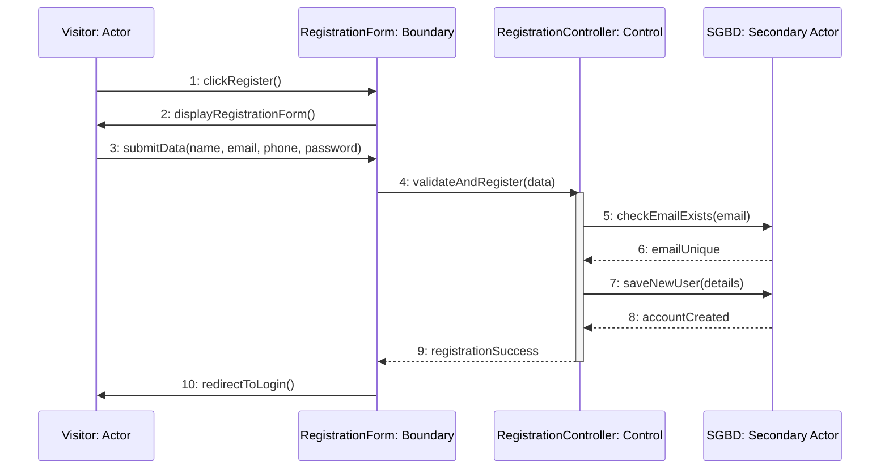
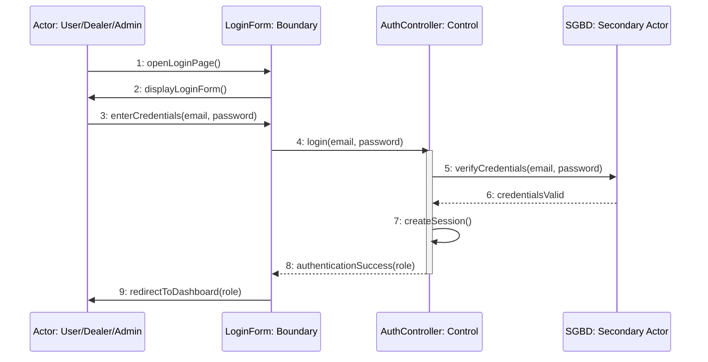
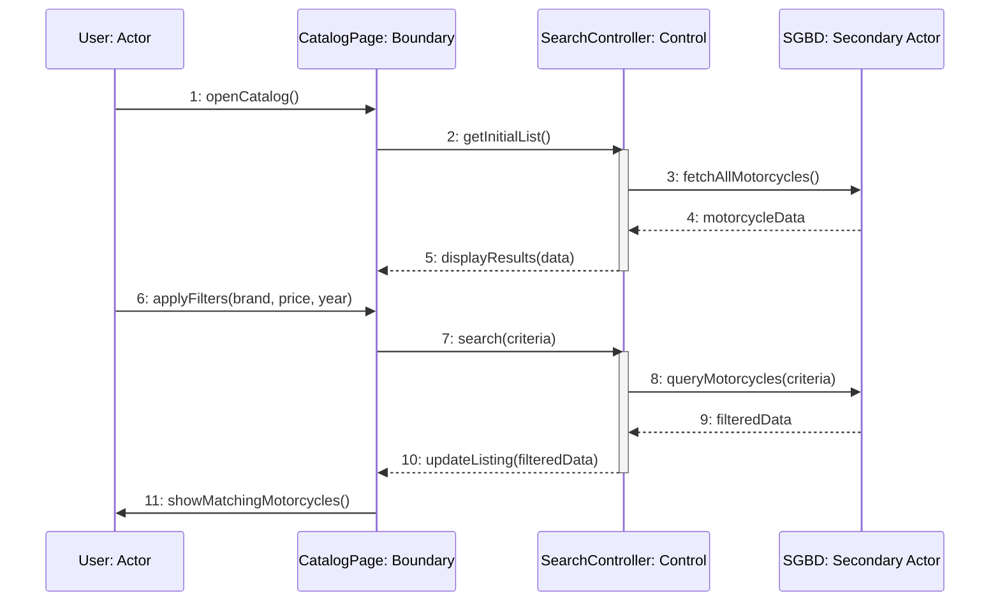

## UC-1 Register Account

```mermaid
sequenceDiagram
    participant U as Visitor: Actor
    participant B as RegistrationForm: Boundary
    participant C as RegistrationController: Control
    participant S as SGBD: Secondary Actor

    U->>B: 1: clickRegister()
    B->>U: 2: displayRegistrationForm()
    U->>B: 3: submitData(name, email, phone, password)
    B->>C: 4: validateAndRegister(data)
    activate C
    C->>S: 5: checkEmailExists(email)
    S-->>C: 6: emailUnique
    C->>S: 7: saveNewUser(details)
    S-->>C: 8: accountCreated
    C-->>B: 9: registrationSuccess
    deactivate C
    B->>U: 10: redirectToLogin()
```

## UC-2 Login

```mermaid
sequenceDiagram
    participant A as Actor: User/Dealer/Admin
    participant B as LoginForm: Boundary
    participant C as AuthController: Control
    participant S as SGBD: Secondary Actor

    A->>B: 1: openLoginPage()
    B->>A: 2: displayLoginForm()
    A->>B: 3: enterCredentials(email, password)
    B->>C: 4: login(email, password)
    activate C
    C->>S: 5: verifyCredentials(email, password)
    S-->>C: 6: credentialsValid
    C->>C: 7: createSession()
    C-->>B: 8: authenticationSuccess(role)
    deactivate C
    B->>A: 9: redirectToDashboard(role)
```

## UC-3 Browse and Search Motorcycles

```mermaid
sequenceDiagram
    participant U as User: Actor
    participant B as CatalogPage: Boundary
    participant C as SearchController: Control
    participant S as SGBD: Secondary Actor

    U->>B: 1: openCatalog()
    B->>C: 2: getInitialList()
    activate C
    C->>S: 3: fetchAllMotorcycles()
    S-->>C: 4: motorcycleData
    C-->>B: 5: displayResults(data)
    deactivate C
    
    U->>B: 6: applyFilters(brand, price, year)
    B->>C: 7: search(criteria)
    activate C
    C->>S: 8: queryMotorcycles(criteria)
    S-->>C: 9: filteredData
    C-->>B: 10: updateListing(filteredData)
    deactivate C
    
    B->>U: 11: showMatchingMotorcycles()
```