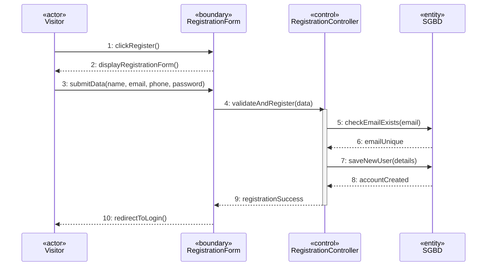
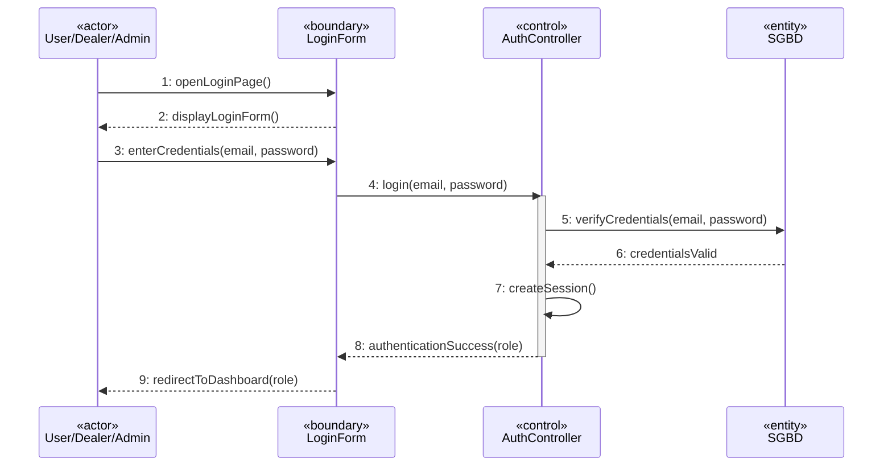
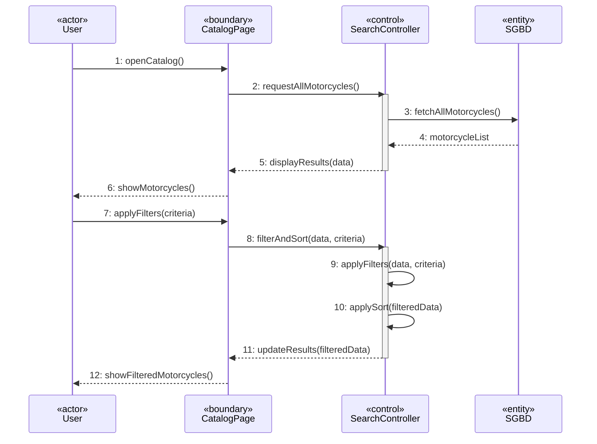
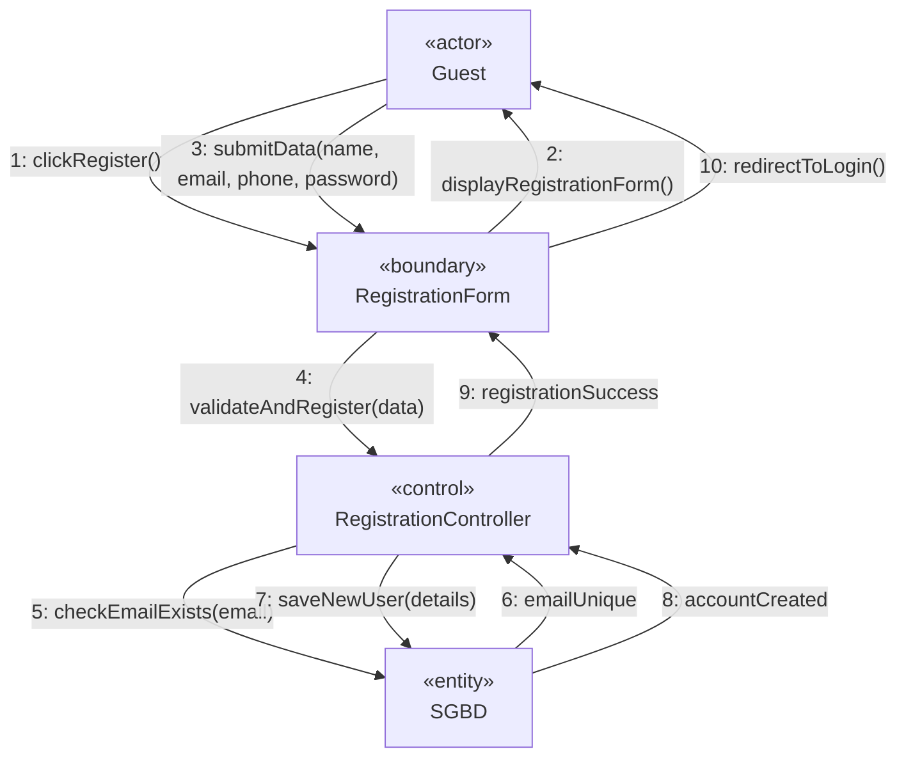
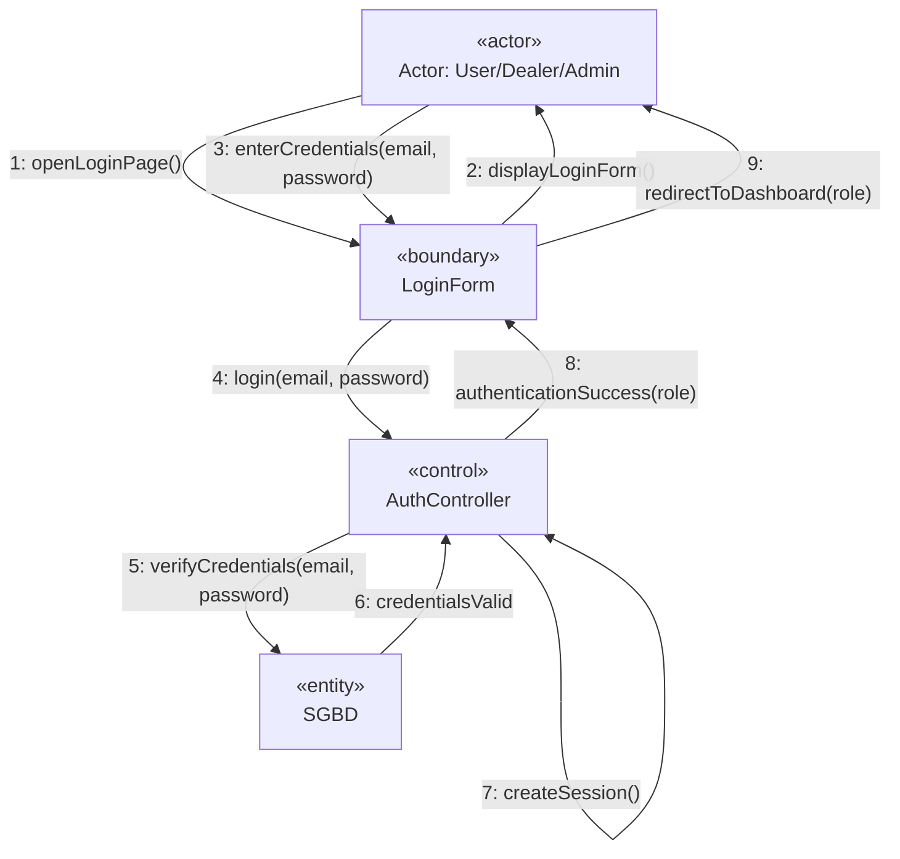
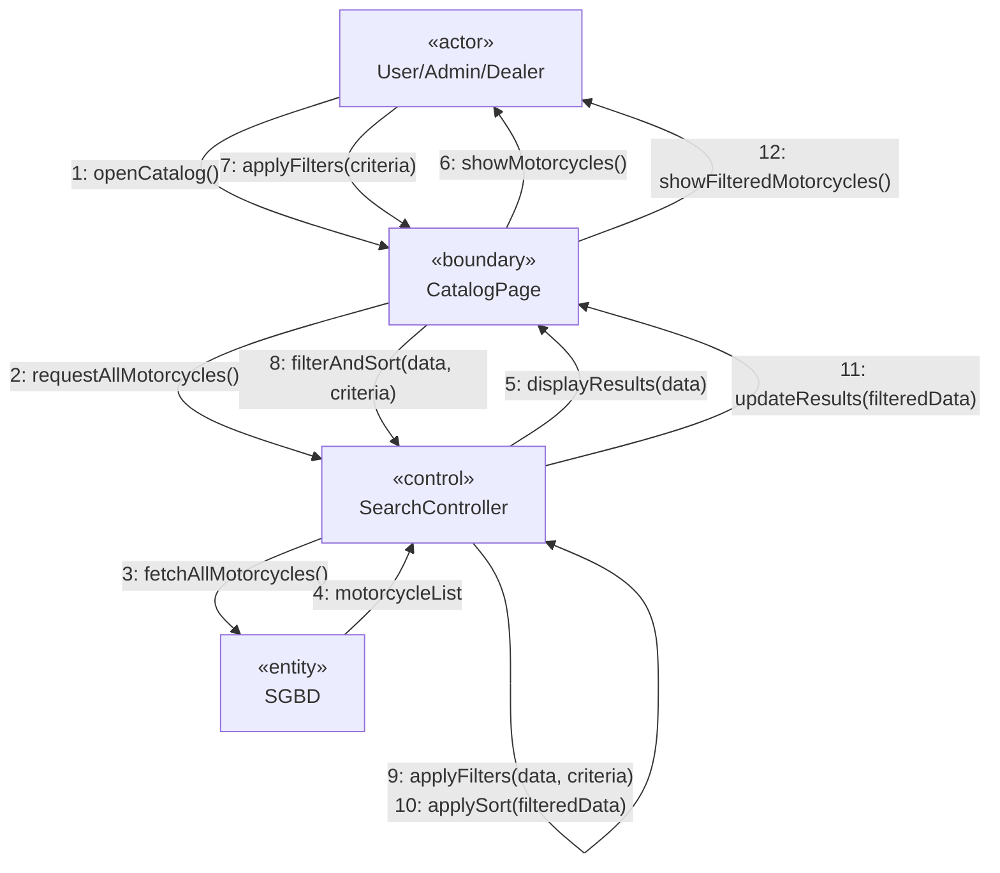

## UC-1 Register Account

```mermaid
sequenceDiagram
    participant U as «actor»<br/>Visitor
    participant B as «boundary»<br/>RegistrationForm
    participant C as «control»<br/>RegistrationController
    participant S as «entity»<br/>SGBD

    U->>B: 1: clickRegister()
    B-->>U: 2: displayRegistrationForm()
    U->>B: 3: submitData(name, email, phone, password)
    B->>C: 4: validateAndRegister(data)
    activate C
    C->>S: 5: checkEmailExists(email)
    S-->>C: 6: emailUnique
    C->>S: 7: saveNewUser(details)
    S-->>C: 8: accountCreated
    C-->>B: 9: registrationSuccess
    deactivate C
    B-->>U: 10: redirectToLogin()
```

## UC-2 Login

```mermaid
sequenceDiagram
    participant A as «actor»<br/>User/Dealer/Admin
    participant B as «boundary»<br/>LoginForm
    participant C as «control»<br/>AuthController
    participant S as «entity»<br/>SGBD

    A->>B: 1: openLoginPage()
    B-->>A: 2: displayLoginForm()
    A->>B: 3: enterCredentials(email, password)
    B->>C: 4: login(email, password)
    activate C
    C->>S: 5: verifyCredentials(email, password)
    S-->>C: 6: credentialsValid
    C->>C: 7: createSession()
    C-->>B: 8: authenticationSuccess(role)
    deactivate C
    B-->>A: 9: redirectToDashboard(role)
```

## UC-3 Browse and Search Motorcycles

```mermaid
sequenceDiagram
    participant U as «actor»<br/>User
    participant B as «boundary»<br/>CatalogPage
    participant C as «control»<br/>SearchController
    participant S as «entity»<br/>SGBD

    U->>B: 1: openCatalog()
    B->>C: 2: requestAllMotorcycles()
    activate C
    C->>S: 3: fetchAllMotorcycles()
    S-->>C: 4: motorcycleList
    C-->>B: 5: displayResults(data)
    deactivate C
    B-->>U: 6: showMotorcycles()
    U->>B: 7: applyFilters(criteria)
    B->>C: 8: filterAndSort(data, criteria)
    activate C
    C->>C: 9: applyFilters(data, criteria)
    C->>C: 10: applySort(filteredData)
    C-->>B: 11: updateResults(filteredData)
    deactivate C
    B-->>U: 12: showFilteredMotorcycles()

```

# Diagrama de comunicare

## UC-1 Register Account

```mermaid
graph
    U["«actor»
    Guest"]
    B["«boundary»
    RegistrationForm"]
    C["«control»
    RegistrationController"]
    S["«entity»
    SGBD"]

    U -->|"1: clickRegister()"| B
    B -->|"2: displayRegistrationForm()"| U
    U -->|"3: submitData(name, email, phone, password)"| B
    B -->|"4: validateAndRegister(data)"| C
    C -->|"5: checkEmailExists(email)"| S
    S -->|"6: emailUnique"| C
    C -->|"7: saveNewUser(details)"| S
    S -->|"8: accountCreated"| C
    C -->|"9: registrationSuccess"| B
    B -->|"10: redirectToLogin()"| U
```

## UC-2 Login

```mermaid
graph
    A["«actor»
    Actor: User/Dealer/Admin"]
    B["«boundary»
    LoginForm"]
    C["«control»
    AuthController"]
    S["«entity»
    SGBD"]

    A -->|"1: openLoginPage()"| B
    B -->|"2: displayLoginForm()"| A
    A -->|"3: enterCredentials(email, password)"| B
    B -->|"4: login(email, password)"| C
    C -->|"5: verifyCredentials(email, password)"| S
    S -->|"6: credentialsValid"| C
    C -->|"7: createSession()"| C
    C -->|"8: authenticationSuccess(role)"| B
    B -->|"9: redirectToDashboard(role)"| A
```

## UC-3 Browse and Search Motorcycles

```mermaid
graph
    U["«actor»
    User/Admin/Dealer"]
    B["«boundary»
    CatalogPage"]
    C["«control»
    SearchController"]
    S["«entity»
    SGBD"]

    U -->|"1: openCatalog()"| B
    B -->|"2: requestAllMotorcycles()"| C
    C -->|"3: fetchAllMotorcycles()"| S
    S -->|"4: motorcycleList"| C
    C -->|"5: displayResults(data)"| B
    B -->|"6: showMotorcycles()"| U
    U -->|"7: applyFilters(criteria)"| B
    B -->|"8: filterAndSort(data, criteria)"| C
    C -->|"9: applyFilters(data, criteria)\n10: applySort(filteredData)"| C
    C -->|"11: updateResults(filteredData)"| B
    B -->|"12: showFilteredMotorcycles()"| U
```
