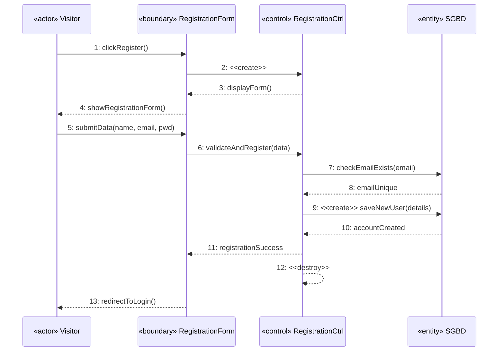
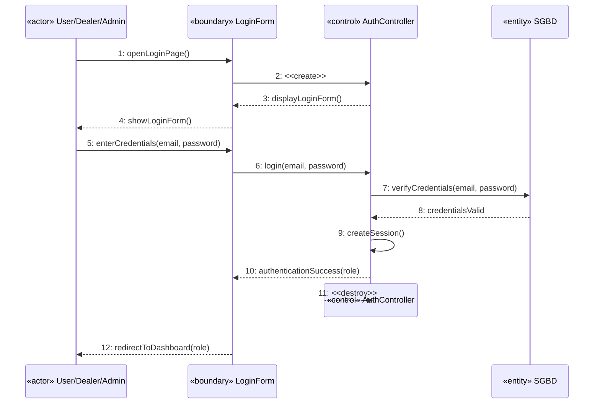
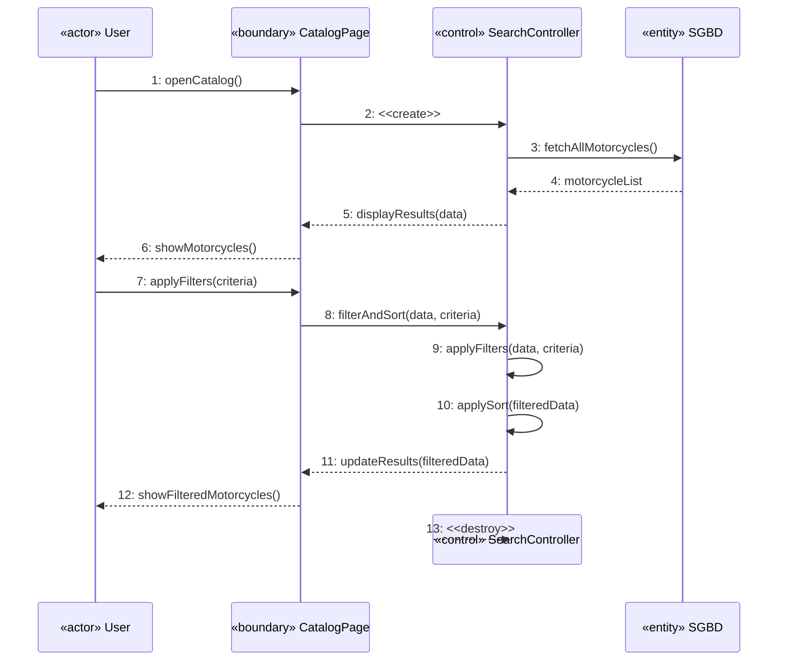
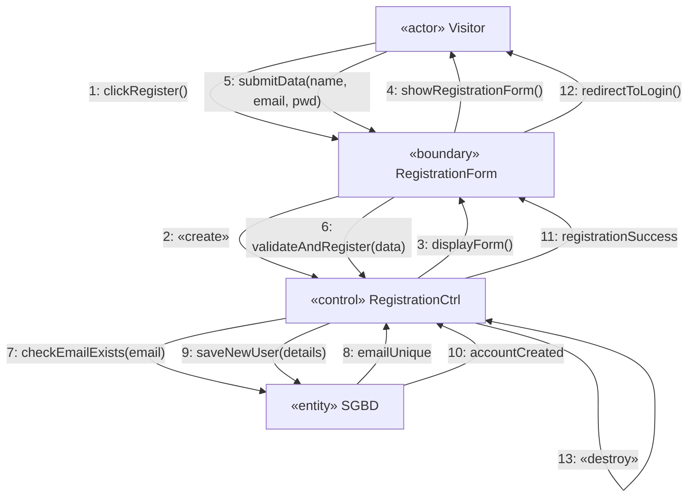
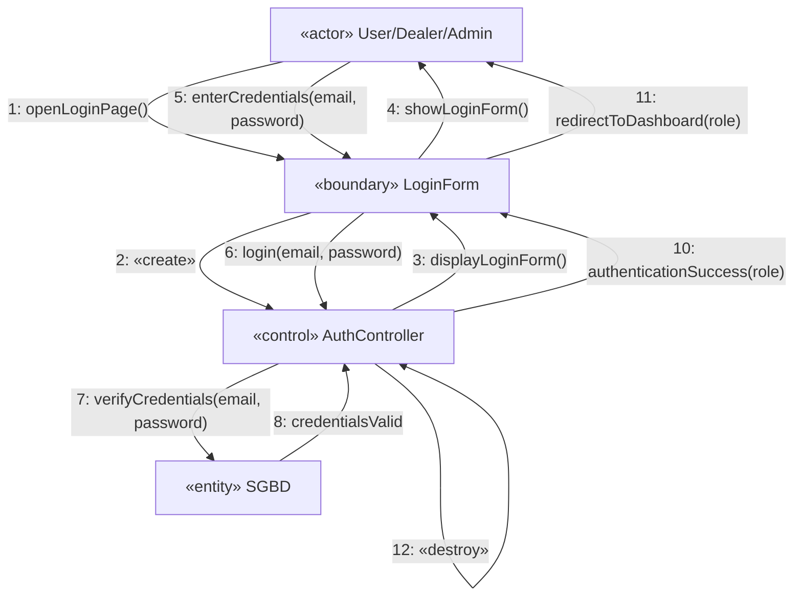
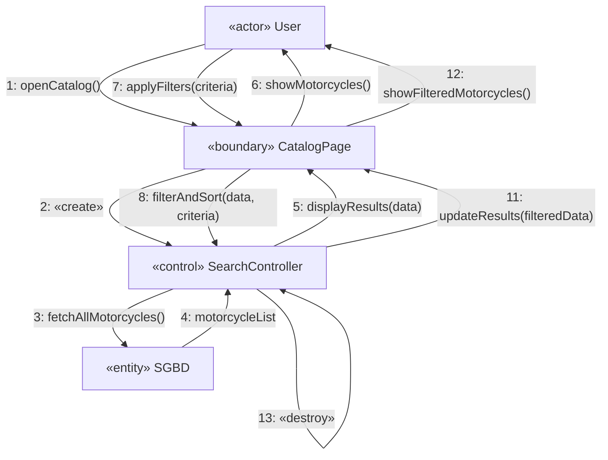

## Diagrame de Secventa

### UC-1: Register Account

### UC-2: Login

---

### UC-3: Browse and Search Motorcycles

---

## Diagrame de Comunicare

### UC-1: Register Account

---

### UC-2: Login

---

### UC-3: Browse and Search Motorcycles

