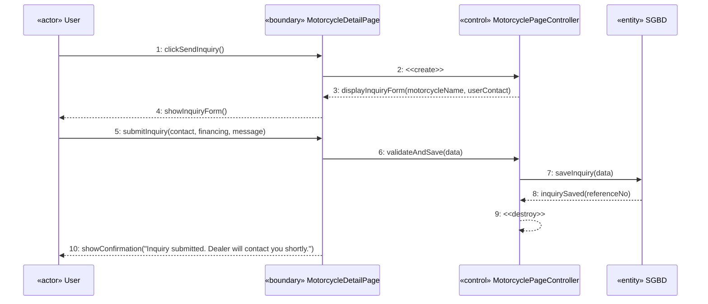
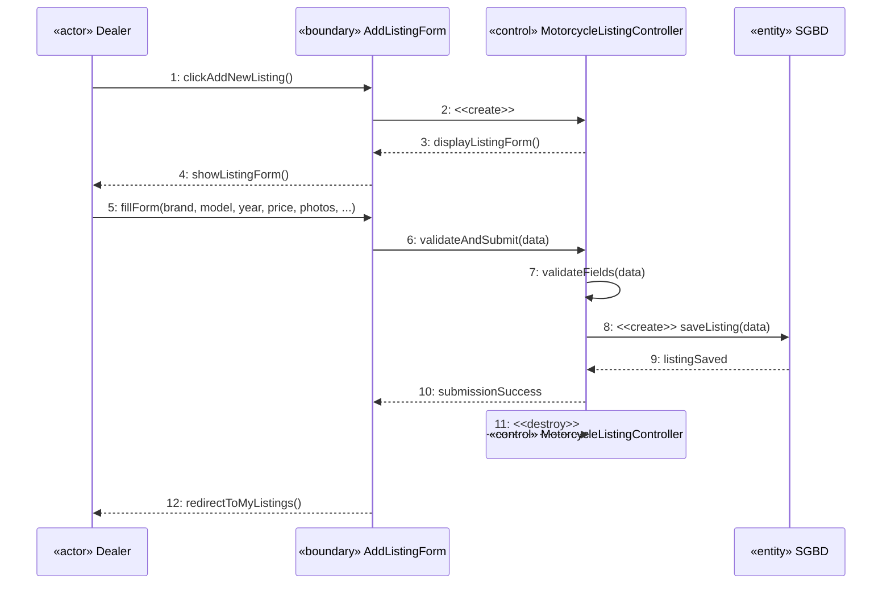
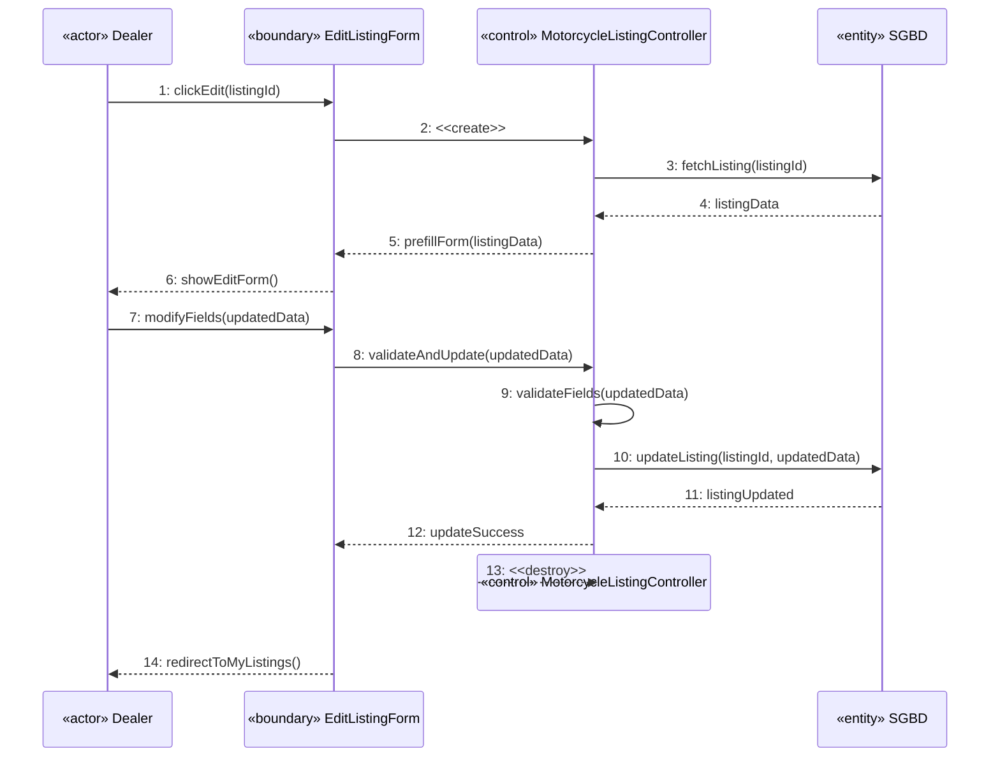
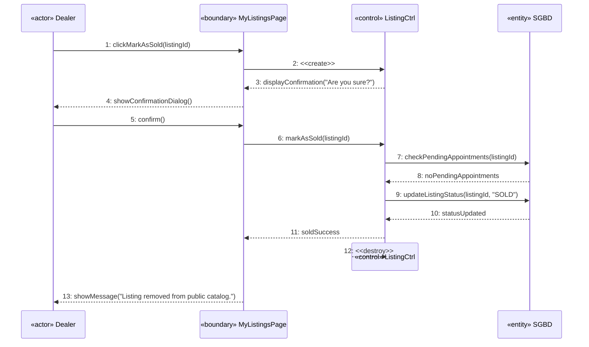
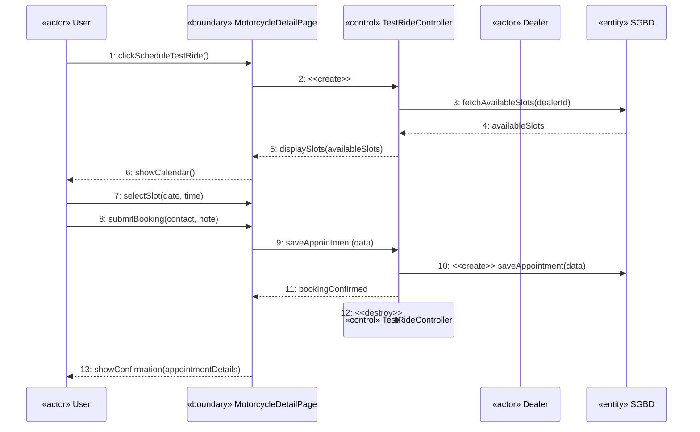
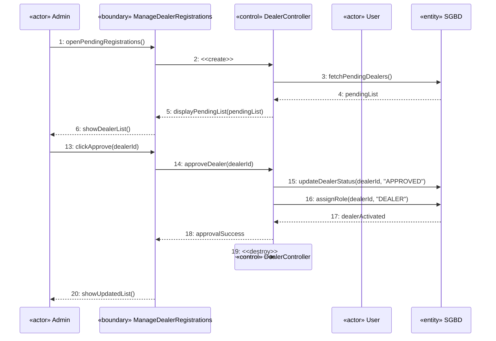
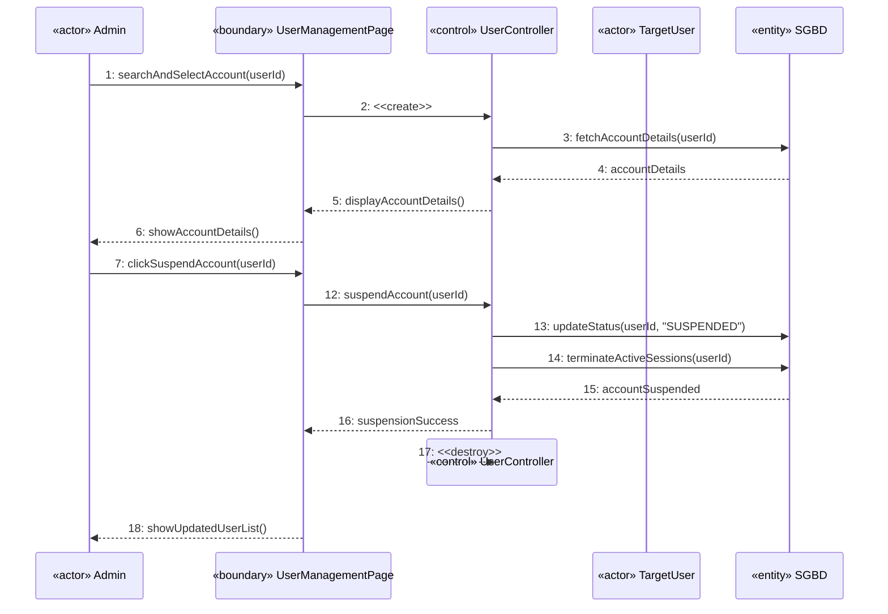

## UC-4: Submit Purchase Inquiry

---

## UC-5: Add Motorcycle Listing

---

## UC-6: Edit Motorcycle Listing

---

## UC-7: Mark Listing as Sold

---

## UC-8: Schedule a Test Ride

---

## UC-9: Approve Dealer Registration

---

## UC-10: Suspend Account

