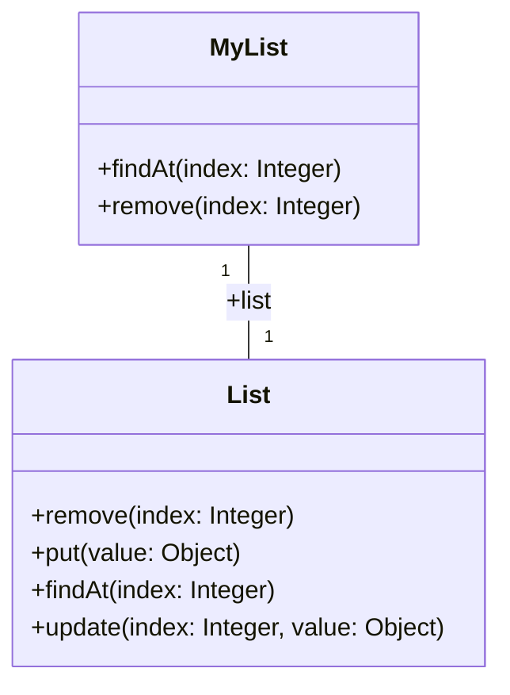
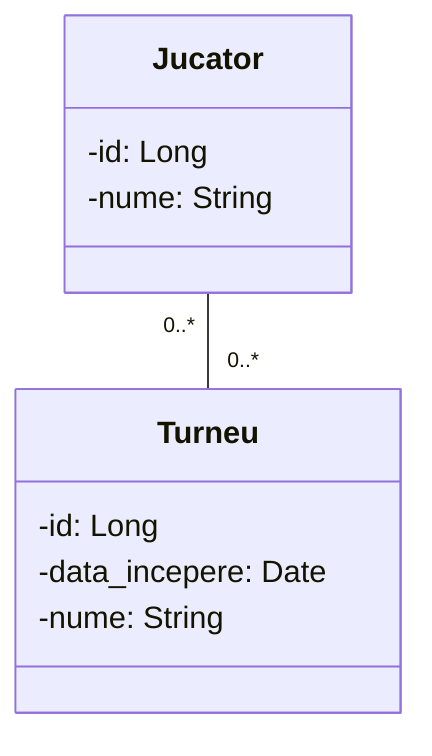

## 🔍 Partea I: Subiecte Teoretice (Subiectul A)

### 📌 Modulul A1 ➔ [Sursa: C.1]
1. Explicați principiul SOLID **Open/Closed** (OCP).
   R:OCP(Open for extension, closed for modification) inseamna ca o clasa nu mai are voie sa fie modificata, insa putem sa o extindem adica sa o mostenim si sa adaugam lucruri.
#### Exemplu

```java
class DiscountCalculator {
    double calculate(String customerType, double price) {
        if (customerType.equals("VIP")) return price * 0.8;
        if (customerType.equals("Student")) return price * 0.9;
        // Vrei un tip nou? Modifici clasa asta ← GREȘIT
        return price;
    }
}
```

```java
interface Discount {
    double apply(double price);
}

class VIPDiscount implements Discount {
    public double apply(double price) { return price * 0.8; }
}

class StudentDiscount implements Discount {
    public double apply(double price) { return price * 0.9; }
}

// Tip nou? Creezi o clasă nouă, nu atingi nimic existent ✓
class BlackFridayDiscount implements Discount {
    public double apply(double price) { return price * 0.5; }
}
```

2. Explicați, folosind un exemplu, principiul SOLID al **separării interfețelor** (ISP).
In loc sa avem o interfata mare cu functii care nu vor fi neaparat implementate, facem interfete mult mai specifice

#### Exemplu:

```java
interface Animal {
    void mananca();
    void doarme();
    void zoara();   // nu toate animalele zboară!
    void inoata();  // nu toate animalele înoată!
}

class Caine implements Animal {
    public void mananca() { System.out.println("Câinele mănâncă"); }
    public void doarme()  { System.out.println("Câinele doarme"); }
    public void inoata()  { System.out.println("Câinele înoată"); }
    public void zoara()   { throw new UnsupportedOperationException("Câinele nu zboară!"); } // 😬
}

class Vultur implements Animal {
    public void mananca() { System.out.println("Vulturul mănâncă"); }
    public void doarme()  { System.out.println("Vulturul doarme"); }
    public void zoara()   { System.out.println("Vulturul zboară"); }
    public void inoata()  { throw new UnsupportedOperationException("Vulturul nu înoată!"); } // 😬
}
```

```java
interface Manancator {
    void mananca();
}

interface Dormitor {
    void doarme();
}

interface Zburator {
    void zoara();
}

interface Inotator {
    void inoata();
}

// Câinele implementează DOAR ce îi este relevant
class Caine implements Manancator, Dormitor, Inotator {
    public void mananca() { System.out.println("Câinele mănâncă"); }
    public void doarme()  { System.out.println("Câinele doarme"); }
    public void inoata()  { System.out.println("Câinele înoată"); }
}

// Vulturul implementează DOAR ce îi este relevant
class Vultur implements Manancator, Dormitor, Zburator {
    public void mananca() { System.out.println("Vulturul mănâncă"); }
    public void doarme()  { System.out.println("Vulturul doarme"); }
    public void zoara()   { System.out.println("Vulturul zboară"); }
}

// Rata implementează tot ce îi este specific
class Rata implements Manancator, Dormitor, Zburator, Inotator {
    public void mananca() { System.out.println("Rața mănâncă"); }
    public void doarme()  { System.out.println("Rața doarme"); }
    public void zoara()   { System.out.println("Rața zboară"); }
    public void inoata()  { System.out.println("Rața înoată"); }
}
```

3. Explicați conceptul de **delegare** și exemplificați (folosind un exemplu diferit de cel din curs).
		R: Delegarea este o alternativa la mostenire atunci cand se doreste implementarea unei functionalitati prin reutilizare.O clasa delega alta clasa atunci cand retransmite mesajul aferent catre acea clasa.

#### Exemplu



4. Care este esența abordării **Design by Contract** referitor la asigurarea fiabilității sistemelor soft?

R:Esenta este respectarea unui "contract" pentru clase, preconditii, postconditii, invariante ce cresc drastic fiabilitatea facand tot procesul mult mai consistent si mai putin expus la bug uri.Daca se respecta preconditiile si invariantele, metoda garanteaza postconditiile.

5. Justificați necesitatea utilizării limbajului **OCL** (Object Constraint Language) în modelare.
Limbajul OCL este necesar în modelare deoarece **completează limitările de expresivitate ale UML-ului**, a cărui natură diagramatică nu permite formularea tuturor constrângerilor dintr-un sistem complex. Principalele sale utilități sunt:

- **Specificarea aserțiunilor:** Permite definirea precisă a precondițiilor, postcondițiilor și a invarianților conform principiilor _Design by Contract (DbC)_.

- **Limbaj declarativ pur:** Evaluarea expresiilor OCL nu produce efecte secundare (nu modifică starea modelului UML).

- **Tipizare puternică:** Fiecare expresie este verificată riguros din punct de vedere al tipurilor de date.

- **Navigare și interogare:** Permite explorarea modelului prin asocieri și definirea regulilor de derivare pentru atribute sau operații.


### 📌 Modulul A2 ➔ [Sursa: A.3]
1. Care sunt regulile de reprezentare a **numelor de roluri** și **multiplicităților** capetelor de asociere în codul sursă? Dați exemple (fragment diagramă de clase / cod sursă aferent). 
R:**Numele de rol** al unui capăt de asociere devine numele atributului (câmpului) din clasa sursă. De exemplu, dacă asocierea dintre `OfiterTeren` și `RaportUrgenta` are rolul `+rapoarteGenerate` pe capătul dinspre `RaportUrgenta`, atunci în clasa `OfiterTeren` va exista un atribut cu acel nume.
**Multiplicitatea** determină tipul atributului:
- `1` sau `0..1` → referință simplă la obiect
- `*`, `0..*`, `1..*` → colecție (listă, set, etc.)
1. Care sunt **proprietățile unei relații de asociere** între clase și cum se reflectă acestea în codul sursă scris pe baza unei diagrame de clase?
Proprietati:
- nume, rol, multiplicitate
**Multiplicitatea** determină tipul atributului:
- `1` sau `0..1` → referință simplă la obiect
- `*`, `0..*`, `1..*` → colecție (listă, set, etc.)

![[Pasted image 20260603222036.png]]
3. Dați un exemplu de **asociere many-to-many bidirecțională** și ilustrați modalitatea de transformare a acesteia în cod sursă.



```java

class Jucator{
	private Long id;
	private String nume;
	private Set<Turneu> turnee;
}

class Turneu{
	private Long id;
	private LocalDateTime data_incepere;
	private String nume;
	private Set<Jucator> jucatori;
}

```

4. Ce înțelegeți prin **asociere unidirecțională**, respectiv **bidirecțională** între două clase? Dați exemple (altele decât cele din curs/seminar) și explicați diferențele la nivelul codului sursă aferent.
R: **Unidirecțională** → navigabilitate într-un singur sens (săgeată), doar una din clase are atribut de tipul celeilalte.
**Bidirecțională** → navigabilitate în ambele sensuri, ambele clase au atribut de tipul celeilalte.

Asociere unidirectionala
![[Pasted image 20260603223653.png]]

Cod ->carucior stie de produs, produs nu stie de carucior

```java

class Carucior{
	private Long id;
	private Set<Produs> produse;
}

class Produs{
	private Long id;
	private String nume;
}

```

many to many mi e lene

5. Care este **utilitatea numelor de rol** la nivelul diagramelor de clase? Cum afectează acestea codul sursă scris pe baza respectivelor diagrame? Dați exemple (model vs. cod).
![[Pasted image 20260603224044.png]]

### 📌 Modulul A3 ➔ Șabloane de Proiectare (Design Patterns)
* *Cerință generală:* Descriere + Exemplu.
* *Notă:* Focus pe înțelegerea conceptului general și aplicabilitate.

### 📌 Modulul A4 ➔ [Sursa: C.3]
1. Dați un exemplu de **invariant** la nivelul unei diagrame UML de clase (în limbaj natural și expresia OCL aferentă) care să utilizeze unul dintre **iteratorii OCL pe colecții**.

![[Pasted image 20260603230042.png]]

```python
context Carucior
	inv existaPepene: self.produse->exists(produs:Produs|produs.nume = 'Harbuz')
```

2. Enunțați un **invariant** la nivelul diagramei UML de clase aferente modelului conceptual al problemei de la punctul B (verso) și scrieți specificarea OCL corespunzătoare.
```python
useless
```
3. Folosind UML și OCL, dați un exemplu de **post-condiție** si **pre-conditie** care să folosească unul dintre iteratorii pe colecții (limbaj natural și expresie OCL).


```python
context Carucior::adaugaProduseInCarucior(produse: Bag<Produs>)
	pre adaugaProdusInCaruciorPre: produse->forAll(p:Produs|p.stock > 0)
	
context Carucior::getAvailableProducts()
	post getAvailableProductsPost: result = self.produse->select(p:Produs|p.stock>0)
```


---

## 📐 Partea II: Analiză pe baza Modelului Nou & Indicațiilor (Curs/Seminar)

Pe baza structurii noului model și a precizărilor oferite de profesor, structura concretă a examenului și punctajul sunt următoarele:

### 📝 SUBIECTUL A (Teorie și Exerciții punctuale)

* **Exercițiul 1 (0.5p):** Va fi extras din **C.1** *(Nu din A.1, conform precizărilor)*.
* **Exercițiul 2 (1.0p):** Va fi extras din **A.3** *(Există și elemente din C.2, însă acelea sunt orientate mai mult spre diagrame deci nu prea respecta cerinta)*.
* **Exercițiul 3 (1.5p):** Șabloane de proiectare (Design Patterns). Probabilitate mare pentru: **Proxy**, **Adapter** sau eventual **Composite**.
* **Exercițiul 4 (1.5p):** Va fi extras din **C.3** (Sintaxă și reguli OCL).

### 💻 SUBIECTUL B (Studiu de caz / Design Complet)

1.  **Use Case Diagram (1.0p):** Identificarea actorilor, a cazurilor de utilizare aferente și realizarea diagramei de cazuri de utilizare UML.
2.  **UI & Detaliere (0.5p):** Descrierea detaliată a unui caz de utilizare dat și realizarea prototipului pentru interfața grafică (schiță/sketch desenat).
3.  **Model Conceptual (1.0p):** Identificarea conceptelor, a atributelor și a relațiilor, urmată de realizarea diagramei de clase pentru modelul conceptual (relații între entitățile de bază).
4.  **Diagramă de Interacțiune (1.0p):** Realizarea unei diagrame de secvență sau de comunicare pentru un scenariu normal al cazului de utilizare descris la punctul 2 (99% sigur ca cere doar sequence diagram!).
5.  **Diagramă de Clase Avansată (1.0p):** Realizarea diagramei de clase finale care să includă și elementele arhitecturale introduse la punctul 4 (ex: controllere, componente UI, elemente de persistenta/SGBD, directoare/Repository etc.). *Trebuie să conțină obligatoriu atât atributele și metodele claselor, cât și relațiile dintre acestea.*
