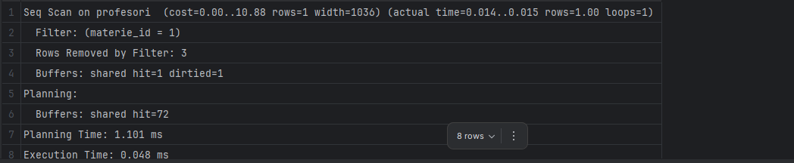
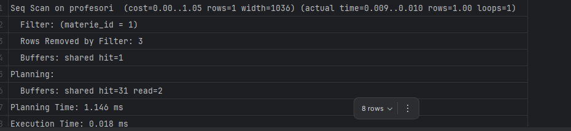

# Configurare Liquibase - Lab 5 SGBD

## Descriere

Liquibase este un tool pentru versionarea si migrarea schemei bazei de date. Permite gestionarea modificarilor structurale intr-un mod organizat si controlat.

## Structura Fisiere

```text
src/main/resources/
├── liquibase.properties
└── db/
    └── changelog/
        ├── db.changelog-master.xml
        └── 001-initial-schema.xml
```

## Configurare

### 1. Dependenta Gradle

In `build.gradle`:

```gradle
implementation 'org.liquibase:liquibase-core:4.24.0'
```

### 2. Fisierul liquibase.properties

Contine configurarea conexiunii la baza de date:

```properties
driver=org.postgresql.Driver
url=jdbc:postgresql://localhost:5432/sgbd_lab
username=postgres
password=123
changeLogFile=db/changelog/db.changelog-master.xml
```

### 3. Master Changelog

Fisierul `db.changelog-master.xml` include toate migrarile:

```xml
<include file="db/changelog/001-initial-schema.xml"/>
```

### 4. Fisierul de migrare

Fisierul `001-initial-schema.xml` contine toate changeSet-urile pentru crearea tabelelor si inserarea datelor initiale.

Tabele create:
- materii
- studenti
- profesori
- note_studenti

Ordinea changeSet-urilor:
1. creare tabel materii
2. creare tabel studenti
3. creare tabel profesori
4. creare tabel note_studenti
5. inserare date initiale

## Utilizare

### Rulare migrari din Java

```java
import utils.LiquibaseManager;

public class Main {
    public static void main(String[] args) {

        LiquibaseManager.initiateMigrations();

        // restul aplicatiei
    }
}
```


Liquibase creeaza automat:
- `databasechangelog`
- `databasechangeloglock`

Aceste tabele sunt folosite pentru evidenta migrarilor executate.

## Avantaje

- versionare a bazei de date
- gestionare usoara a modificarilor
- posibilitate de rollback
- istoric al schimbarilor
- integrare usoara in proiect
- suport pentru automatizare

## Adaugare migrari noi

1. Creezi un nou fisier in `db/changelog/`
2. Adaugi include in `db.changelog-master.xml`
3. Definesti noile changeSet-uri
4. Rulezi migrarile

Exemplu:

```xml
<include file="db/changelog/002-add-feature.xml"/>

```


## Evaluare influenta indexului asupra performantei

#### FARA INDEX:


#### CU INDEX:




0.048ms vs 0.018ms aproape de 3 ori mai rapid

## Strategii de Stergere in Bazele de Date

### Hard Delete

Hard delete este metoda traditionala de stergere prin care inregistrarea este eliminata complet din baza de date cu comanda DELETE. In Liquibase, aceasta se implementeaza printr-un changeSet care executa operatia de stergere.

Avantaje:
- Elibereaza spatiu de stocare
- Simplifica implementarea
- Performanta mai buna pentru query-uri

Dezavantaje:
- Pierderea datelor ireversibila
- Riscul stergerii accidentale
- Imposibil de recuperat audit trail-ul complet

### Soft Delete

Soft delete este o strategie de stergere logica unde inregistrarea nu este eliminata fizic din baza de date, ci doar marcata ca stearsa. Se implementeaza printr-o coloana de tip boolean (is_deleted) sau timestamp (deleted_at).

In Liquibase, soft delete necesita:
1. Adaugarea coloanei is_deleted sau deleted_at
2. Modificarea query-urilor SELECT pentru a filtra inregistrarile sterse
3. Actualizarea logicii de delete pentru update in loc de delete fizic

Exemplu de migrare Liquibase:

```xml
<changeSet id="009-add-soft-delete-column" author="admin">
    <addColumn tableName="studenti">
        <column name="deleted_at" type="TIMESTAMP" defaultValue="null">
            <constraints nullable="true"/>
        </column>
    </addColumn>
</changeSet>
```

Avantaje:
- Recuperare usoara a datelor
- Audit trail complet
- Conformitate cu regulile de reglementare (GDPR)

Dezavantaje:
- Necesita filtrare in fiecare query
- Consum mai mare de spatiu
- Complexitate crescuta

## Optimistic Locking

Optimistic locking este o tehnica care permite gestionarea conflictelor de concurenta fara blocare de inregistrari. Se implementeaza printr-o coloana de versiune (version column) care se incrementeaza la fiecare modificare.

### Implementare in Hibernate

Hibernate suporta optimistic locking prin adnotarea @Version:

```java
@Entity
@Table(name = "studenti")
public class Student extends Entity<Long> {
    
    @Version
    @Column(name = "version")
    private Long version;
    
    // restul clasei
}
```

Migrarile Liquibase necesare:

```xml
<changeSet id="010-add-version-column" author="admin">
    <addColumn tableName="studenti">
        <column name="version" type="BIGINT" defaultValue="0">
            <constraints nullable="false"/>
        </column>
    </addColumn>
</changeSet>
```

### Mecanismul Optimistic Locking

1. Se citeste entitatea cu versiunea curenta
2. Se modifica entitatea in memorie
3. Se executa UPDATE cu conditie: WHERE id = ? AND version = ?
4. Daca versiunea nu mai corespunde, se arunca OptimisticLockException
5. Aplicatia poate incepe din nou cu versiunea curenta

### Scenarii de Utilizare

Optimistic locking este ideal pentru:
- Operatii cu conflict redus
- Aplicatii web cu multi-user concurent
- Situatii unde locks pesimiste ar fi prea restrictive

Nu este potrivit pentru:
- Date cu conflict frecvent
- Sisteme real-time
- Operatii long-running

## Fluxul Migrarilor Liquibase in Lab 5

Migrarile sunt organizate sequential in fisierul `001-initial-schema.xml`:

Am inclus toate migrarile in fisierul `db.changelog-master.xml`

```xml
<include file="db/changelog/001-initial-schema.xml"/>
    <include file="db/changelog/002-add-phone-column.xml"/>
    <include file="db/changelog/003-create-projects-table.xml"/>
    <include file="db/changelog/004-insert-projects-data.xml"/>
    <include file="db/changelog/005-alter-nota-to-numeric6-2.xml"/>
    <include file="db/changelog/006-add-indexes.xml"/>
    <include file="db/changelog/007-add-version-column-profesori.xml"/>
    <include file="db/changelog/008-soft-delete-profesori.xml"/>
```


### Extensiile Posibile

Migrarile viitoare pot include:
- Adaugare coloane pentru soft delete (deleted_at)
- Adaugare coloane de versiune pentru optimistic locking (version)
- Crearea de indecsi pentru optimizare query-uri
- Adaugare de constrangeri suplimentare (CHECK constraints)
- Crearea de view-uri materializate pentru rapoarte


